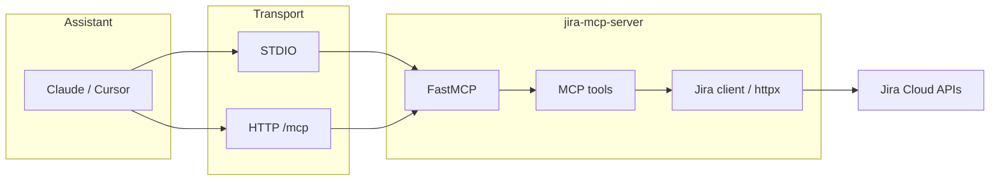

# Jira MCP Server

A **prototype** [Model Context Protocol (MCP)](https://modelcontextprotocol.io/) server that connects **Jira Cloud** to AI assistants such as **Claude** and **Cursor**. It is built with the official [**`mcp`**](https://github.com/modelcontextprotocol/python-sdk) SDK and [**FastMCP**](https://gofastmcp.com/), and exposes a small set of **high-level tools** tuned for how product teams actually work: sprint health, backlog order, velocity trends, blockers, and lightweight issue creation.

Use it when you want the model to **read real Jira state** and **act on your board**—without copy-pasting tickets or writing ad-hoc scripts.

---

## At a glance

| | |
|---|---|
| **Best for** | Product managers, program leads, and tech leads who live in Jira and want AI grounded in live data |
| **Jira edition** | **Jira Cloud** (API token auth) |
| **Python** | **3.11+** |
| **Transports** | **STDIO** (default, local assistants) · **HTTP** (`/mcp` for remote-capable clients) |

---

## Screenshots (placeholders)

Add your own captures under `docs/screenshots/` (create the folder if needed) and replace the paths below. Recommended filenames are suggested so docs stay consistent.

**1 — MCP server enabled in the assistant**


*Placeholder: show your client’s MCP settings or server list with `jira-mcp-server` connected and no errors.*

**2 — Tool call in context**


*Placeholder: one turn where the model calls a Jira tool and summarizes the JSON for a real project key.*

**3 — PM-style output**


*Placeholder: final assistant reply formatted as a status note, email draft, or slide bullets.*

> **Tip:** Redact project keys, names, and tokens in screenshots you share publicly.

---

## Why Product Managers care

Traditional chat is **stateless** relative to your backlog. This server gives the model **structured tools** so it can:

- Answer “where are we in the sprint?” using **live** scope and completion signals.
- Pull the **top of the backlog** in **rank order** for planning conversations.
- Surface **blocked** work with **link-based** context when Jira encodes dependencies that way.
- Approximate **velocity** over recent **closed** sprints for forecasting discussions.
- **Draft** follow-ups (emails, Slack, exec summaries) grounded in the same data.
- **Create** a Story/Task/Bug when you explicitly ask it to—without leaving the chat.

You stay in control: the assistant only changes Jira when a tool like **`create_jira_task`** is invoked, and you can review the arguments before sending.

---

## How a Product Manager would use it

Think in **workflows**. You say the goal; the model picks tools. Below are patterns that work well in practice.

### Weekly status / stakeholder update

1. Ask for a **project snapshot** and risks: e.g. “Use **`summarize_project`** for **`PROJ`** and give me a five-bullet exec update.”
2. If blockers matter this week: “Run **`find_blocked_issues`** for **`PROJ`** and add a ‘needs leadership’ subsection.”
3. Optional: “Using the same data, draft a short email to engineering leadership.”

### Sprint health check (mid-sprint)

- “Call **`get_current_sprint`** for **`PROJ`**. Are we ahead or behind? What should we cut or defer?”
- Combine with backlog: “Show **`get_backlog_issues`** (top 10). What’s the smallest cut if we need to protect the sprint goal?”

### Backlog review / refinement prep

- “List **`get_backlog_issues`** with **`max_results` 20** for **`PROJ`**. Group by theme and flag items missing acceptance criteria (infer from summary/labels).”
- “Propose a refinement agenda from the top 8 items.”

### Release / capacity conversation

- “Run **`get_team_velocity`** for **`PROJ`** with **`last_n_sprints` 5**. Is trend **flat**, **up**, or **down**? What does that imply for the next milestone?”

### Unblocking and escalation

- “**`find_blocked_issues`** on **`PROJ`**. Summarize blockers by theme and suggest owners for each.”

### Capturing work from the conversation

- “Create a **Story** in **`PROJ`** titled **…**, description **…**, assign **`pm@company.com`**, **`3`** points, labels **`discovery`**, **`q2`**.”  
  (Tool: **`create_jira_task`** — assignee can be an **email** resolved to an Atlassian `accountId`.)

### Example prompts (copy-paste)

| Intent | Example prompt |
|--------|----------------|
| Sprint pulse | “Use **`get_current_sprint`** for **`PROJ`** and tell me if we’re on track for the sprint goal.” |
| Backlog top | “**`get_backlog_issues`** for **`PROJ`**, 15 issues—what should we pull in next?” |
| Exec brief | “**`summarize_project`** for **`PROJ`**: exec summary, risks, and three recommendations.” |
| Dependencies | “**`find_blocked_issues`** for **`PROJ`** and draft a Slack update for the team.” |
| Trend | “**`get_team_velocity`** for **`PROJ`**, last 4 sprints—explain the trend in plain language.” |
| Create issue | “**`create_jira_task`**: summary **…**, project **`PROJ`**, type **Story**, description **…**.” |

Replace **`PROJ`** with your real **project key** (the short code in Jira, not the numeric id).

---

## Features

- **STDIO** — default; used by **Claude Desktop**, **Cursor**, and other local MCP hosts.
- **HTTP** — Streamable HTTP endpoint at `http://<host>:<port>/mcp` for clients that support remote MCP.
- **Structured responses** — tools return JSON-friendly dicts with **`ok`** / **`error`** so the model can reason reliably.
- **Safe logging** — logs go to **stderr only**; STDIO transport reserves **stdout** for MCP.
- **APIs used** — Jira **REST v3** and **Agile REST** (`/rest/agile/1.0/...`), including **`GET /rest/api/3/search/jql`** for JQL.

---

## Requirements

- **Python 3.11+**
- **Jira Cloud** site and a user with access to the target project
- For sprint/backlog/velocity tools: a **board** for the project (ideally **Scrum**; see design notes below)

---

## Setup (step by step)

### 1. Clone and enter the project

```bash
cd jira-mcp-server
```

### 2. Create a virtual environment

**macOS / Linux**

```bash
python3.11 -m venv .venv
source .venv/bin/activate
```

**Windows (PowerShell)**

```powershell
py -3.11 -m venv .venv
.\.venv\Scripts\Activate.ps1
```

### 3. Install dependencies

```bash
pip install --upgrade pip
pip install .
```

For local development:

```bash
pip install -e ".[dev]"
```

### 4. Configure Jira credentials

```bash
cp .env.example .env
```

Edit **`.env`** (or set the same variables in your MCP host config):

| Variable | Required | Description |
|----------|:--------:|-------------|
| `JIRA_URL` | Yes | Site base URL, e.g. `https://yourcompany.atlassian.net` (no trailing slash). |
| `JIRA_EMAIL` | Yes | Atlassian account email associated with the API token. |
| `JIRA_API_TOKEN` | Yes | Create at [Atlassian API tokens](https://id.atlassian.com/manage-profile/security/api-tokens). |
| `JIRA_STORY_POINTS_FIELD_ID` | No | e.g. `customfield_10016`. If unset, the server tries to auto-detect a “story point” field. |
| `JIRA_MCP_HTTP_HOST` | No | HTTP bind host (default `127.0.0.1`). |
| `JIRA_MCP_HTTP_PORT` | No | HTTP port (default `8765`). |

**Security:** treat the token like a password. Do **not** commit `.env`, paste tokens into tickets, or share screenshots that expose them.

### 5. Run the server (smoke test)

**STDIO** (typical for Claude / Cursor—the host launches this process):

```bash
python -m jira_mcp_server --transport stdio
```

**HTTP** (standalone):

```bash
jira-mcp-server --transport http --host 127.0.0.1 --port 8765
```

MCP over HTTP is usually at **`http://127.0.0.1:8765/mcp`** (path may vary if you customize FastMCP).

**CLI reference**

```text
python -m jira_mcp_server [--transport stdio|http] [--host HOST] [--port PORT] [--log-level DEBUG|INFO|WARNING|ERROR]
```

---

## Connect Claude Desktop

1. Open your MCP config file, for example on macOS:  
   `~/Library/Application Support/Claude/claude_desktop_config.json`
2. Add a server entry that points at **your** venv Python and passes environment variables (or rely on a wrapper script that loads `.env`).

```json
{
  "mcpServers": {
    "jira": {
      "command": "/absolute/path/to/jira-mcp-server/.venv/bin/python",
      "args": ["-m", "jira_mcp_server", "--transport", "stdio"],
      "env": {
        "JIRA_URL": "https://yourcompany.atlassian.net",
        "JIRA_EMAIL": "you@company.com",
        "JIRA_API_TOKEN": "your_token_here"
      }
    }
  }
}
```

3. Restart **Claude Desktop**. Confirm the server appears in the MCP UI (see screenshot placeholder §1).

---

## Connect Cursor

1. Open **Cursor Settings → MCP** (wording may vary slightly by version).
2. Add an MCP server using the same **`command`**, **`args`**, and **`env`** pattern as Claude Desktop: STDIO transport, `python -m jira_mcp_server`, and your Jira variables.
3. For clients that support **HTTP MCP**, run the HTTP transport locally or on a secured host, then point the client at the **`/mcp`** URL per Cursor’s remote MCP documentation.

---

## Tools reference

| Tool | What it does |
|------|----------------|
| `get_current_sprint` | Active sprint metadata, issue counts, completion **%** (story points if available, else issue counts). |
| `get_backlog_issues` | Top of backlog in order, with status, labels, assignee, points when configured. |
| `create_jira_task` | Create an issue (`summary`, `project_key`, optional `description`, `issue_type`, `assignee`, `story_points`, `labels`). |
| `summarize_project` | Consolidated snapshot: project info, samples, sprint + velocity + blockers, **risks**, **recommendations**. |
| `find_blocked_issues` | Non-done issues that appear blocked via **issue links** (e.g. “is blocked by”). |
| `get_team_velocity` | Last **N** **closed** sprints: completed work per sprint and a coarse **trend** label. |

---

## Architecture



| Module | Responsibility |
|--------|----------------|
| `jira_mcp_server/server.py` | FastMCP app, tool definitions, shared implementation helpers. |
| `jira_mcp_server/jira_client.py` | REST/Agile calls, pagination, story-point detection, blocking-link parsing. |
| `jira_mcp_server/config.py` | Environment loading and validation. |
| `jira_mcp_server/main.py` | `main()`, stderr logging, transport selection. |

### Design notes (read before trusting numbers)

- **Primary board** — first **scrum** board returned for the project; if none exists, the first board is used (with a log warning).
- **Velocity** — **approximate**; based on issues returned per closed sprint and **Done** status category; uses story points when the field exists and is populated.
- **Blocked issues** — inferred from **issue links** (types/names involving “block”). Teams that only use labels or custom flags may see fewer matches until workflows align or the tool evolves.
- **Prototype** — validate outputs against Jira for high-stakes planning; field IDs and boards differ across sites.

---

## Troubleshooting

| Symptom | What to check |
|---------|----------------|
| `401` / `403` from tools | `JIRA_EMAIL`, `JIRA_API_TOKEN`, and project **Browse** / **Create** permissions. |
| No sprint / backlog | Project **key** correct; a **board** exists; Scrum sprint actually **started**. |
| Story points always `null` | Set **`JIRA_STORY_POINTS_FIELD_ID`** explicitly for your site. |
| MCP disconnects or empty tools | Nothing may write to **stdout**; this server logs to **stderr** only. |
| `pip` refuses install | Requires **Python 3.11+** per `pyproject.toml`. |

---

## License

MIT
